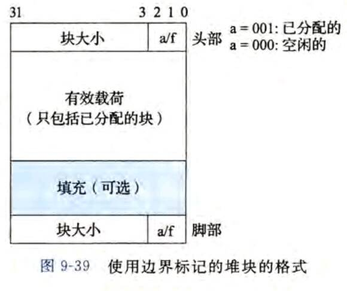
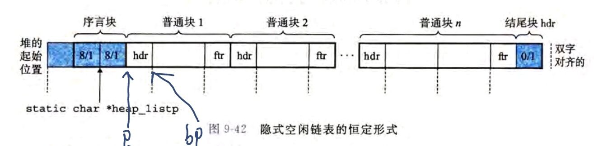

# 1.介绍
在这个实验室中，您将为C程序编写一个动态存储分配器，即您自己版本的malloc、free和realloc例程。我们鼓励您创造性地探索设计空间，并实现正确、高效和快速的分配器。

# 2.Logistics
你最多可以两个人一组工作。对作业的任何澄清和修改都将发布在课程网页上。
# 3.Hand Out Instructions
首先，将malloclab-handout.tar复制到一个受保护的目录中，您计划在其中进行工作。然后给出命令：tar xvf malloclab-chandout.tr。这将导致许多文件被解压缩到目录中。您将修改并提交的唯一文件是mm.c。mdriver.c程序是一个驱动程序，允许您评估解决方案的性能。使用命令make生成驱动程序代码，并与命令一起运行/mdriver-V。（-V标志显示有用的摘要信息。）

查看mm.c文件，您会注意到一个c结构团队，您应该在其中插入所需的关于组成编程团队的一两个人的识别信息。马上做，这样你就不会忘记。

完成实验室后，您将只提交一个文件（mm.c），其中包含您的解决方案。
# 4.How to Work on the Lab
您的动态存储分配器将由以下四个函数组成，它们在mm.h中声明，在mm.c中定义。
```C
int mm_init(void);
void *mm_malloc(size_t size);
void mm_free(void *ptr);
void *mm_realloc(void *ptr, size_t size);
```
我们给您的mm.c文件实现了我们能想到的最简单但功能正确的malloc包。以此为起点，修改这些函数（并可能定义其他私有静态函数），使它们遵循以下语义：

•mm_init：在调用mm_malloc mm_realloc或mm_free之前，应用程序（即将用于评估实现的跟踪驱动程序）会调用mm_init来执行任何必要的初始化，例如分配初始堆区域。如果执行初始化时出现问题，则返回值应为-1，否则为0。

•mm_malloc:mm_malloc例程返回一个指针，指向至少size字节的已分配块有效负载。整个分配的块应该位于堆区域内，并且不应该与任何其他分配的块重叠。我们将把您的实现与标准C库（libc）中提供的malloc版本进行比较。由于libc-malloc总是返回与8字节对齐的有效负载指针，因此malloc实现也应该这样做，并始终返回与8个字节对齐的指针。

•mm_free：mm_free例程释放ptr指向的块。它什么也不返回。只有当传递的指针（ptr）由先前对mmmalloc或mmrealloc的调用返回并且尚未释放时，才能保证此例程工作。

•mm_realloc:mm_realloc例程返回一个指针，指向具有以下约束的至少size字节的已分配区域。

–如果ptr为NULL，则该调用相当于mm_malloc（size）；

–如果大小等于零，则调用等效于mm_free（ptr）；

–如果ptr不为NULL，则它一定是由先前对mm_malloc或mm_realloc的调用返回的。对mm_realloc的调用将ptr（旧块）指向的内存块的大小更改为大小字节，并返回新块的地址。请注意，新块的地址可能与旧块相同，也可能不同，这取决于您的实现、旧块中的内部碎片数量以及realloc请求的大小。新块的内容与旧ptr块的内容相同，最多为新旧大小中的最小值。其他一切都未初始化。例如，如果旧块是8个字节，而新块是12个字节，则新块的前8个字节与旧块的前八个字节相同，最后4个字节未初始化。类似地，如果旧块是8个字节，而新块是4个字节，则新块的内容与旧块的前4个字节相同。

这些语义与相应的libc malloc、realloc和free例程的语义相匹配。在shell中键入man malloc以获取完整的文档。

# 5.Heap Consistency Checker
动态内存分配器是出了名的难以正确高效编程的野兽。它们很难正确编程，因为它们涉及大量非类型化的指针操作。您会发现编写一个堆检查器非常有帮助，它可以扫描堆并检查其一致性。

堆检查器可能检查的一些示例如下：

•空闲列表中的每个块是否都标记为空闲？

•是否有任何连续的空闲块以某种方式逃脱了聚结？

•是否每个空闲区块都在空闲列表中？

•空闲列表中的指针是否指向有效的空闲块？

•是否有任何分配的区块重叠？

•堆块中的指针是否指向有效的堆地址？

您的堆检查器将由mm.c中的函数int mm_check(void)组成。它将检查您认为谨慎的任何不变量或一致性条件。当且仅当堆一致时，它返回一个非零值。您不限于列出的建议，也不需要检查所有建议。当mm_check失败时，我们鼓励您打印出错误消息。

这个一致性检查器用于您自己在开发过程中的调试。当您提交mm.c时，请确保删除对mm_check的任何调用，因为它们会降低您的吞吐量。将为您的mm_check功能提供样式点。一定要把你要检查的内容写进评论和文档。

# 6.支持例程
memlib.c包为动态内存分配器模拟内存系统。您可以在memlib.c中调用以下函数：

•void *mem_sbrk(int incr)：按incr字节扩展堆，其中incr是一个正非零整数，并返回一个指向新分配堆区域第一个字节的通用指针。语义与Unix sbrk函数相同，只是mem_sbk只接受一个正的非零整数参数。

•void *mem_heap_lo(void)：返回指向堆中第一个字节的通用指针。

•void *mem_heap_hi(void)：返回指向堆中最后一个字节的通用指针。

•size_t mem_heapsize(void)：以字节为单位返回堆的当前大小。

•size_t mem_pagesize(void)：以字节为单位返回系统的页面大小（在Linux系统上为4K）。


# 7.跟踪驱动程序
malloclab-handout.tar分发版中的驱动程序mdriver.c测试mm.c包的正确性、空间利用率和吞吐量。驱动程序由malloclab-handout.tar发行版中包含的一组跟踪文件控制。每个跟踪文件都包含一系列分配、重新分配和释放方向，这些方向指示驱动程序按一定顺序调用mm_malloc、mm_realloc和mm_free例程。驱动程序和跟踪文件与我们对handin mm.c文件进行分级时使用的文件相同。

驱动程序mdriver.c接受以下命令行参数：
•-t＜tracedir＞：在目录tracedir中查找默认的跟踪文件，而不是在config.h中定义的默认目录。

•-f＜tracefile＞：使用一个特定的跟踪文件进行测试，而不是使用默认的跟踪文件集。

•-h：打印命令行参数的摘要。

•-l：除了学生的malloc包之外，还运行和测量libc malloc。

•-v：详细输出。在紧凑表中打印每个跟踪文件的性能细分。

•-V：更详细的输出。在处理每个跟踪文件时打印其他诊断信息。在调试期间很有用，可以确定哪个跟踪文件导致malloc包失败。

# 8.编程规则
•您不应更改任何mm.c的接口。

•不应调用任何与内存管理相关的库调用或系统调用。这排除了在代码中使用malloc、calloc、free、realloc、sbrk、brk或这些调用的任何变体。

•您不允许在mm.c程序中定义任何全局或静态复合数据结构，如数组、结构、树或列表。但是，您可以在mm.c中声明全局标量变量，如整数、浮点和指针。

•为了与返回在8字节边界上对齐的块的libc malloc包保持一致，分配器必须始终返回与8字节边界对齐的指针。driver将为您执行此要求。

# 9.实现
这一部分是我自己写的 不是对文档的翻译

书P588:**在本书中**，假设字是4字节的对象，而双字是8字节的对象

以下内容基于书P597

分配器的块格式如P596图9-39



一个块是由一个字的头部、有效载荷、可能的一些额外的填充以及一个字的脚部共四部分组成的。其中脚部是头部的副本。

头部编码了这个块的大小(四部分加起来的大小)以及这个块是已分配的还是空闲的。如果加强一个双字对齐约束条件，那么块大小就总是8的倍数，故块大小的最低3位总是0。因此只需要内存大小的29个高位，释放剩余3位来编码其他信息。此处我们用剩余三位000表示块空闲，001表示块已分配。

如果一个块想要获取前一个块的信息，可以访问前一个块的脚部(它紧挨着自己的头部)，否则无法方便地获取这个信息。，这是添加脚部的意义。



一些宏
```cpp
/* Basic constants and macros */
#define WSIZE 4
#define DSIZE 8
#define CHUNKSIZE (1 << 12)

#define MAX(x, y) ((x) > (y) ? (x) : (y))

/* Pack a size and allocated bit into a word */
#define PACK(size, alloc) ((size) | (alloc))

/* Read and write a word at address p */
#define GET(p) (*(unsigned int *)(p))
#define PUT(p, val) (*(unsigned int *)(p) = (val))

/* Read the size and allocated fields from address p */
#define GET_SIZE(p) (GET(p) & ~0x7)
#define GET_ALLOC(p) (GET(p) & 0x1)

// 下面这两个return p
/* Given block ptr bp, compute address of its header and footer */
#define HDRP(bp) ((char *)(bp)-WSIZE)
#define FTPR(bp) ((char *)(bp) + GET_SIZE(HDRP(bp)) - DSIZE)

// 下面这两个return bp
/* Given block ptr bp, compute address of next and previous blocks */
#define NEXT_BLKP(bp) ((char *)(bp) + GET_SIZE(((char *)(bp)-WSIZE)))
#define PREV_BLKP(bo) ((char *)(bp)-GET_SIZE(((char *)(bp) + DSIZE)))
```
你注意到上述宏中有指针p和bp，其中p指向整个块的地址，bp指向有效载荷的地址

对于一个已分配块有等式p + WSIZE = bp


# 10.check
我写的时候默认函数传入参数名为ptr时，对应的是p而非bp，但是参考了一些博客似乎都应该认为传入的参数是bp

修改过后，我直接从lab官网下载下来的两个测试用例得分分别是77/100和90/100

但是在博客上找到的已经失传的更大的测试集上的得分上48/100

闲了再来改改吧


